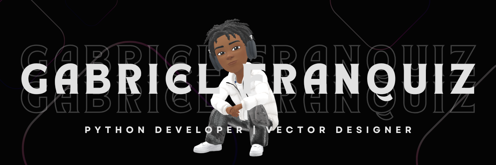

# Hi, I'm Gabriel Franquiz

I am a 16-year-old developer focused on building efficient and structured solutions. I combine a strategic and analytical mindset with practical programming skills to solve real-world problems and lead work teams. 

## 📍 About Me
- Recently completed my secondary education; applying for the International Baccalaureate before university. 
- Certified in Python Programming through Stanford's **Code in Place** program.
- Bilingual: Fluent in both Spanish and English (Advanced), also learning other languages.
- Passionate about backend development, automation, and tech architecture; also interested in game development.
- I'm deeply interested in the financial world as a stock and ETFs trader/investor.

## 📌 Skills
### Core & Coding:

          

### Multimedia & Productivity:

      

### Learning:

   

- **Others:**
  - Vectorpea, Antigravity (IDE), Excel/Google Sheets, Word/Google Docs, PowerPoint/Google Slides, Google Forms, Google Classroom, 

- **Specialties:** 
  - Automation scripts, community architecture (Advanced Discord Server optimization).
  - Professional video editing, vector design.
  - Indie game development.

## 🔍 Featured Projects
- **[Guess It! AI Game](https://codeinplace.stanford.edu/cip6/share/qkTeTBAEX06UNAnBiaE2)**: A terminal-based game integrated with the OpenAI GPT API, featuring dynamic AI interactions, environment variable protection, and clean control flow logic.

### 📊 My GitHub Stats

    
    
  

---
*“Focusing on building long-term value through clean code and strategic execution.”*

